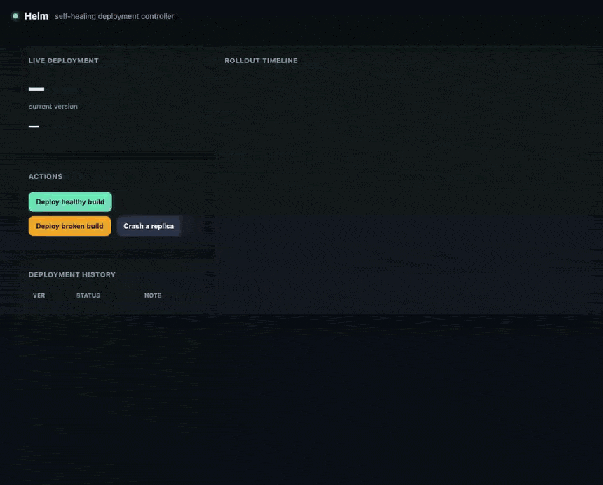

# Helm — CI/CD Pipeline with Self-Healing Deployments

A deployment controller — a **mini-Kubernetes rollout engine** — that ships new versions with a
**rolling update**, gates each replica on a **readiness probe**, runs a **post-deploy smoke
test**, and **automatically rolls back** if health checks fail — plus a **liveness monitor** that
restarts any replica that crashes at runtime. Paired with real GitHub Actions CI.

<p align="center">
  
  <br>
  <em>Rolling deploy → zero-downtime upgrade → a broken build auto-rolled-back by the smoke test → a crashed replica self-healed. (<a href="docs/demo.mp4">full-quality video</a>)</em>
</p>

> **On the stack:** the strongest résumé version of this project targets Kubernetes, which needs
> Docker/a cluster. This build implements the **same orchestration state machine** — rolling
> updates, readiness gating, post-deploy smoke tests, automatic rollback, and self-healing — over
> local process "pods," so it runs anywhere without a cluster. The control logic is identical to
> what a `Deployment` + `kubectl rollout undo` gives you; only the pod runtime differs.

## The problem this is built around

"I set up GitHub Actions" is table stakes. What actually differentiates a deploy pipeline — and
reduces real on-call pain — is what happens **after** the deploy:

1. **A bad version must never take traffic.** Even a build that passes CI can break at runtime.
   The rollout brings up new replicas **while the old ones keep serving**, gates them on a
   **readiness probe**, and only after they're all ready runs a **smoke test** on the critical
   path. If anything fails, it **rolls back automatically** — the new replicas are discarded and
   the old version keeps serving, so there's **zero downtime and no bad version in production.**
2. **Readiness isn't enough.** A replica can report healthy (`/health` 200) yet have a broken
   business path. That's the exact case a **post-deploy smoke test** exists to catch — and this
   controller catches it and rolls back.
3. **Things crash at runtime.** A liveness monitor continuously probes replicas and **restarts
   any that die** — self-healing without human intervention.

## Architecture

```
  git push ─► GitHub Actions CI (lint + test + build)  ── the "CI" half
                        │  (artifact / version)
                        ▼
             Deployment Controller  ── the "CD + self-healing" half
                        │
   ┌────────────────────┼─────────────────────────────┐
   │  Rolling update:   │  bring up new replicas one at a time,        │
   │  ─ readiness probe │  gated on /health; OLD replicas keep serving │
   │  ─ smoke test      │  hit /work (critical path) once all ready    │
   │  ─ auto-rollback   │  any failure → discard new, keep old (0 dt)  │
   └────────────────────┼─────────────────────────────┘
                        │
             Liveness monitor: probe replicas continuously;
             a dead replica is restarted automatically (self-healing)
```

Each "replica" is a real subprocess running the sample service (`app/service.py`), which exposes
`/health` (readiness/liveness) and `/work` (the critical path the smoke test hits). Rollout
history and every event are recorded in Postgres and shown on a live dashboard.

## The hardest decisions

### 1. Roll forward without stopping the old version → instant, safe rollback
The rollout brings up the **entire** new replica set and proves it (readiness + smoke) **before**
retiring any old replica. So a failed deploy needs no "undo": the new replicas are simply
discarded and the old ones — which never stopped — keep serving. Rollback is instant and
downtime-free because the good version was never taken offline. (This is why real Kubernetes keeps
the old ReplicaSet around during a rollout.)

### 2. Readiness gates traffic; the smoke test gates the *business path*
A replica passing its readiness probe means "it's up," not "it works." The controller models both
failure modes: `BROKEN_HEALTH` (readiness never opens → rollout aborts early) and `BROKEN_WORK`
(healthy but `/work` 500s → the **smoke test** catches it post-deploy and rolls back). The demo
uses the second — a build that passes CI and looks healthy but is broken — because that's the
scary one a naive pipeline ships.

### 3. Self-healing is a separate, always-on loop
Deployment safety (rollback) and runtime safety (restart crashed replicas) are different concerns,
so they're different mechanisms: the rollout state machine, and a liveness monitor that runs on an
interval and replaces any replica that stops answering — restoring desired replica count without a
human.

### 4. A Pod abstraction so the logic is testable
The controller talks to replicas through a tiny `Pod` interface (`ready` / `alive` / `smoke` /
`stop`). Real pods are subprocesses; **fake pods** are in-process booleans. That lets the entire
rollout/rollback/self-heal **state machine be unit-tested deterministically** — no flaky
subprocess timing — while the same code runs real processes in production.

## Verifying it yourself

The state machine is tested with fake pods against a real Postgres (for the audit trail):

```bash
python scripts/migrate.py
python -m pytest -q
```

Tests cover: a **successful rollout**; a **readiness failure** rolling back while the previous
version keeps serving untouched (zero downtime); a **smoke-test failure** rolling back a
healthy-but-broken build; a good **rolling upgrade** switching versions and retiring old replicas;
an **initial deploy failure** leaving nothing running; **self-healing** restarting a crashed
replica back to full health; and that history/events are recorded.

## Running locally

Requires Python 3.11+ and PostgreSQL.

```bash
python -m venv .venv && source .venv/bin/activate
pip install -r requirements.txt
python scripts/migrate.py
python scripts/devrun.py            # control plane + dashboard
open http://localhost:8097
```

On the dashboard: **Deploy healthy build** (watch the rolling update), **Deploy broken build**
(watch readiness pass, the smoke test fail, and the automatic rollback), and **Crash a replica**
(watch the monitor self-heal it).

## What I'd change to make it "real Kubernetes"

- **Run on Kubernetes**: package the sample app as a **Docker multi-stage build**, push to GHCR,
  and deploy with a `Deployment` (rolling `maxSurge`/`maxUnavailable`, readiness/liveness probes);
  the controller's smoke-test-and-rollback becomes a CI job running `kubectl rollout status` +
  `kubectl rollout undo` on failure. The state machine here maps 1:1.
- **Canary / blue-green**: shift a small % of traffic to the new version first and watch error
  rate before full rollout (a stretch the current all-or-nothing rollout doesn't do).
- **Deploy-correlated observability**: Prometheus + Grafana to answer "did error rate spike right
  after this deploy?" — pair it with the observability pipeline (Project 6).
- **Progressive delivery with metrics gates** (Argo Rollouts / Flagger style) so rollback triggers
  on real SLO breaches, not just a synthetic smoke test.

## License

MIT
